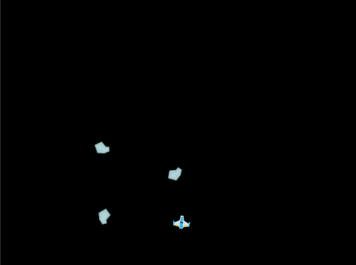
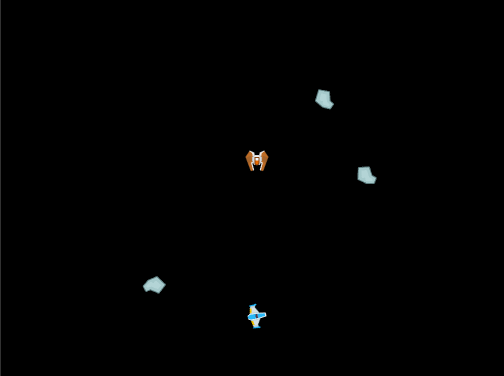

# Playable Fashion: Coding In Depth

This module of Playable Fashion is deep dive into to the basics of Unity game development.

## The Game
This module is designed around [an Asteroids clone](AsteroidsGame.zip). The player controls a ship with the keyboard keys, rotating with left and right, moving forward and backward with up and down, firing bullets with the space bar, and must destroy a field of asteroids in order to win. Each asteroid spawns three smaller asteroids when destroyed, and the smaller asteroids do not spawn anything. If the user touches an asteroid, they lose.

The class will hack on this game, modifying its components to make new experiences. Additionally, the class will write the code needed to add an enemy to the game with basic AI that will follow the player and fire bullets at them.

It is designed to be hit all of the major corners of Unity while remaining hackable and teachable. The components are well commented and designed to be interchanged.

Importantly, the scripts that the class will write together to implement the enemy are left out of the package, as their availability would defeat the purpose of writing them.

## Folder Structure
### `Scripts`
The components of the game are all well commented. Their inner workings and variables are all explained in the source code. There are many components included that are not used in the game, but can be added during the hacking session.

### `Prefabs`
The game uses prefabs for bullets, asteroid spawning, and the game over screens.

### `Art`
We include a bunch of art from [kenney.nl](http://kenney.nl/) that students can use while customizing the game.
