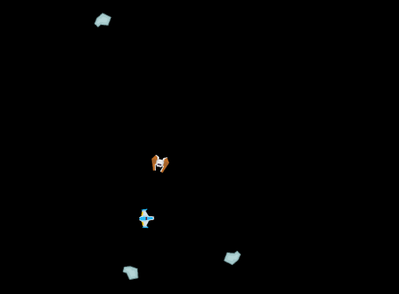
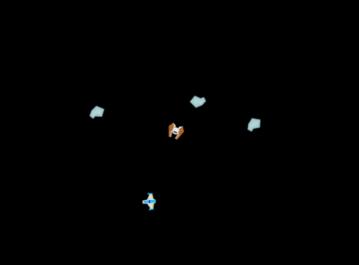

# Session 3
## Collision Detection
When things touch, they are said to have *collided*. Detecting when this happens is called *collision detection*. Unity provides collision detection through its physics engine, which might seem odd, but the part of Unity that is concerned with making things move realistically needs to know how and when things collide so that it can animate them. The point to stress here is that even if you aren't doing physics as we normally understand it, you still need Unity's physics components to detect if things are touching or not.

### 2D vs 3D
This is further complicated by the fact that Unity actually has *two* physics engines built in, one for [3D physics](https://en.wikipedia.org/wiki/PhysX) and one for [2D physics](https://en.wikipedia.org/wiki/Box2D). *They are distinct engines that do not interact*, so you normally have to pick one for your game and use it. Furthermore, the 2D engine was added later, so Components that use it have `2D` added to their name (e.g. `Rigidbody2D`, `BoxCollider2D`). Physics Components *without* 2D are 3D. This lesson only uses the 2D engine.

### Rigidbodies and Colliders
Attaching the built in `Rigidbody2D` component to a GameObject causes it to participate in the physics simulation. By default, it will apply gravity, and setting Gravity Scale to 0 disables that. A GameObject without a `Rigidbody2D` is effectively ignored by the physics engine.

The `Rigidbody2D` component does not specify the *shape* of an object, though. That is left up to the `Collider2D` components. There are a bunch of them in different shapes, and you can add as many as you want to a GameObject. We use `PolygonCollider2D` in this lesson as it gives the tightest collision detection. Colliders can be [triggers](https://unity3d.com/learn/tutorials/topics/physics/colliders-triggers), which means they do not react physically, and generate different messages. We are not using trigegrs in this lesson.

Strictly speaking, for the collision of two objects to be detected, *both* need colliders and *at least one* needs a rigidbody. To keep things simple and consistent, we just insist that every object be given a rigidbody and a collider if we want collision detection.

### Detecting Collision
Since we set up the enemy in the last session to have a `Rigidbody2D` and a `PolygonCollider2D`, and the Player's bullets already have a `Rigidbody2D` and `BoxCollider2D` attached, we're ready to start writing code! Create a new component on the Enemy named `DestroySelfOnCollision` that will remove the attached gameObject whenever collision is detected. Guide your class through writing the following code (not the final code yet, but close):

```cs
using System.Collections;
using System.Collections.Generic;
using UnityEngine;

public class DestroySelfOnCollision : MonoBehaviour
{
	void OnCollisionEnter2D(Collision2D collision)
	{
      Destroy(gameObject);
	}
}

```

#### Explanation
Most of this code is like the `AlwaysLookAt` component from the previous session, except with `OnCollisionEnter2D` in place of `Update`. Stress the similarities with your class.

##### `OnCollisionEnter2D`
Recall that Unity uses specially named C# methods to send "messages" to your components. `Start` gets called once at the start of a game, `Update` gets called once every frame, and here `OnCollisionEnter2D` gets called the first frame of a collision detected. This answers our first question: How do we know when two GameObjects touch? The `OnCollisionEnter2D` method is called on *every component* attached to *every GameObject* involved in the collision. The order they they get called in is generally random, but you can [control it](https://docs.unity3d.com/Manual/class-ScriptExecution.html) to some extent.

Unlike `Start` and `Update`, `OnCollisionEnter2D` passes additional information to you when it is triggered in the form of the [parameter `collision`](https://docs.unity3d.com/ScriptReference/Collision2D.html). This *describes* the collision, and has properties like [`contacts`](https://docs.unity3d.com/ScriptReference/Collision2D-contacts.html) (the specific points where the collision occurred) and [`relativeVelocity`](https://docs.unity3d.com/ScriptReference/Collision2D-relativeVelocity.html), the relative velocity of the colliding objects.

##### `Destroy`
[`Destroy`](https://docs.unity3d.com/ScriptReference/Object.Destroy.html) removes the specified GameObject, in this case [`gameObject`](https://docs.unity3d.com/ScriptReference/Component-gameObject.html) is the GameObject attached to the component in question.

### Play the Game
Play the game and demonstrate that this does cause the enemy to disappear when it touches bullets! However:






The code we wrote will cause the enemy to disappear when it touched *anything*, which is not what we want. We need to update our code to only react to *certain* objects, in this case, the player's bullets.
