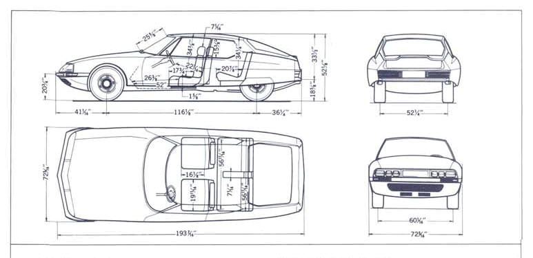

# Session 2
## C# vs Unity

Unity is the game engine we are working in, but C# is the *programming language* we are writing code in. Their relationship is important to explain.

### C# the language
C# is a language designed by Microsoft in 1999. It is *object oriented*, meaning it wants you to organize your code into [*classes*](https://en.wikipedia.org/wiki/Object-oriented_programming#Objects_and_classes). Classes are collections of data called *fields* and code called *methods*. C# doesn't tell you exactly *how* you organize your code, but classes, fields, and methods are the tools it gives you.

Another important aspect of C# is that it is what's called a *statically typed* language, meaning that every value in your code has to be labeled with the *type* of data it represents. A type can be something built in to C#, like numbers (e.g. `int`, `float`) or a class written in C#. In practice, these classes either come from Microsoft (like [`DateTime`](https://msdn.microsoft.com/en-us/library/system.datetime.aspx)), Unity (like [`AudioClip`](https://docs.unity3d.com/ScriptReference/AudioClip.html)), a library you imported, or you.

#### Classes vs Instances
The difference between classes and instances is a consistent source of confusion, and unfortunately unavoidable in Unity. The explanation we've used is that a class is like a design drawing of a car. You can't ride it or use it right away, but it tells you everything you need to know to build an actual car. It tells you what a car can do, what it can't do, its parameters, and so on.



An instance is like an actual car. You can make as many cars from the same designs as you want, and they'll all be similar in what they can do and how they behave.


But, they're all unique things now. If you paint one car, it does not affect the rest. On the flipside, if you change the design of the car (the class, in this analogy) to say that all these cars should have three wheels, then when you start making new cars again they will all be affected.

So, a class is a *blueprint* from which *instances* (or "objects") can be made. You can then access the *instance fields and methods* on that instance. In the following examples we will use the [`Vector3`](https://docs.unity3d.com/ScriptReference/Vector3.html) and [`Input`](https://docs.unity3d.com/ScriptReference/Input.html) classes from Unity.

```cs
Vector3 v = new Vector3(3, 4, 5); // v is now an instance of the class Vector3
v.x;                              // you can access the x instance field
v.Set(300, 400, 500);             // you can access the Set instance method
```

But classes are more than just blueprints in C#. They can contain their own fields and methods that can be accessed from anywhere in the program!

```cs
Vector3 w = new Vector3(7, 3, 1);
Vector3 v = new Vector3(3, 4, 5);
Vector3.Distance(w, v); // Vector3.Distance is a method that lives in the Vector3 class itself
Input.GetKey("space");  // Input.GetKey is a method that lives in the Input class
```

This appears to invalidate the "everything is a GameObject or Component" rule, but that rule is only true of Unity. C# has its own rules, and to use Unity effectively you need work towards understanding both systems.

### C# In Unity
Unity *uses* C#'s object oriented features to implement very different ideas, namely the [*entity-component-system*](history.md). These two approaches can seem in tension at times, and can result in a bit of repetitive code.

When you write your own components, you do that by writing a C# class. When you expose parameters to the Unity inspector, you do that by writing public C# fields. When you react to Unity events, you do that by writing C# methods.
