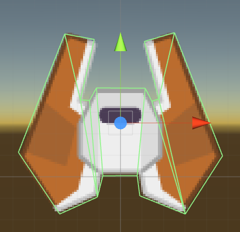

# Session 2
## Enemy Setup

Create an empty game object and name it "Enemy". Add a `SpriteRenderer`, `PolygonCollider2D`, and `Rigidbody2D` components with the following values

Mostly defaults, except `Rigidbody2D`'s Gravity Scale has been set to 0. The image used here is `enemyRed1` but feel free to use whatever you want as long as the graphic points up.

### Planning
Before we dive into code, it is a good idea to plan how following the player is going to work. Show the class the GIF from the previous page

and ask them to break that behavior down into components, the way you did in [the first session](semantics.md#exercise-break-down). Guide them towards the conclusion that the enemy is

1. Always rotating to face the player
2. Always moving towards the player
