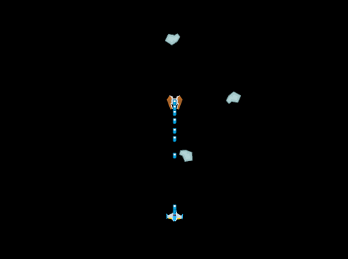
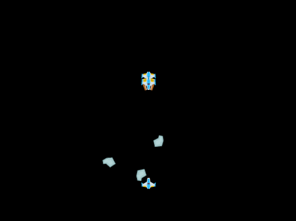

# Session 4
## Instantiating

To begin, we will make the enemy spawn bullets. Guide your students to write the following script:

```cs
using System.Collections;
using System.Collections.Generic;
using UnityEngine;

public class CloneOnTimer : MonoBehaviour {
	public GameObject clone;

	void Update () {
		Instantiate(clone, transform.position, transform.rotation);
	}
}
```

### Explanation
[`Instantiate`](https://docs.unity3d.com/ScriptReference/Object.Instantiate.html) is Unity's way of making *copies* of GameObjects. To fire a stream of bullets, we actually make *copies* of a single bullet. `Instantiate` takes three arguments:

1. What to clone (`clone` in this case)
2. Where to put the new object (`transform.position`, so at the enemy's position)
3. How to rotate the new object (`transform.rotation`, so the same rotation as the enemy)

Drag the Bullet prefab from the Prefabs folder into the Clone variable in the inspector and play the game.



#### Discussion
Discuss this version of the game with your class. Some possible questions include:

* What is happening?
* Why are there so many bullets?
  * *Because `Update` gets called every frame*
* Is this what you expected? If so, why? If not, what were you expecting?
* Why aren't the bullets hurting the player?
  * *Because Bullet prefab has destroying scripts for asteroids only*

#### Exercise
Try dragging different objects into the Clone variable to make nonsensicle variations. What happens when enemy fires Asteroids? What happens when they fire *Players*? The results are both hilarious and can lead to illuminating discussions.




Make sure to have the class return the Bullet to the Clone variable before moving on.
